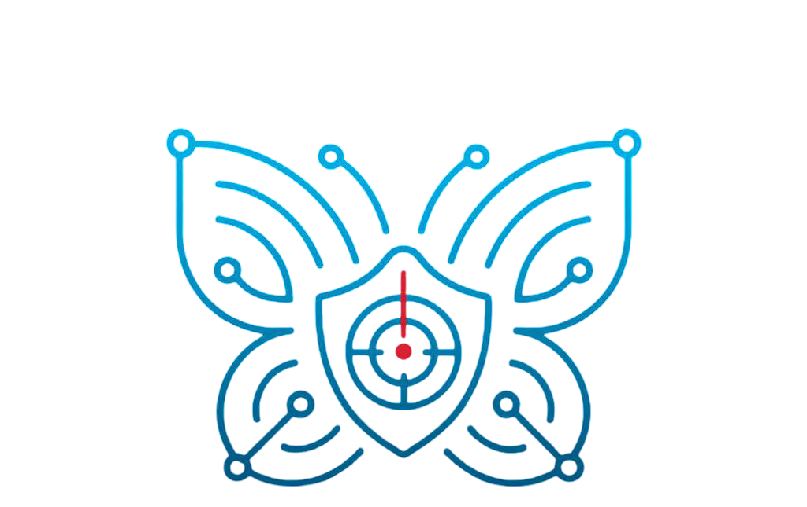

<h1 align="center">
  
   
  Butterfly-Threat-Detection
</h1>

  <i>An AI-driven threat detection and reporting platform inspired by the butterfly effect.</i>

---

Butterfly is an AI-powered system built to identify early indicators of security threats. Inspired by the “butterfly effect,” the system analyzes incoming threat reports, network activity, and communication patterns to detect subtle anomalies before they evolve into serious incidents.

By capturing these minor but critical signals, **Butterfly** empowers security teams with timely insights to act swiftly and mitigate potential threats effectively.

---

## ✨ Features

- Real-time threat analysis
- NLP-based pattern detection
- Visual reports and mapping
- Alert automation
- Butterfly-effect inspired detection

---

## 🛠 Tech Stack

- **Frontend:** React.js, Tailwind CSS, Leaflet.js  
- **Backend:** Node.js, Express.js, Socket.IO  
- **NLP & ML:** Python, Flask, spaCy, scikit-learn  
- **Database:** MongoDB  
- **Scheduler:** Python cron / node-cron  
- **Map APIs:** Leaflet.js / Google Maps  
- **PDF Reports:** jsPDF / Puppeteer  

---

